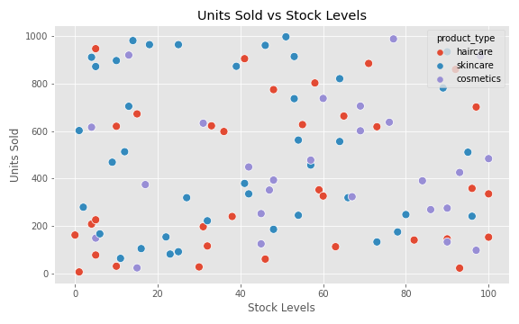
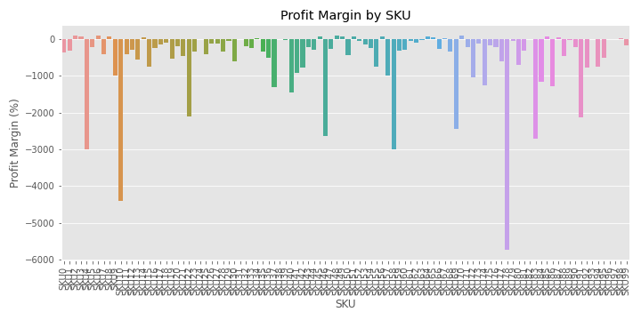
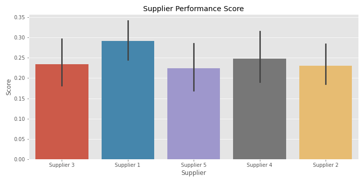
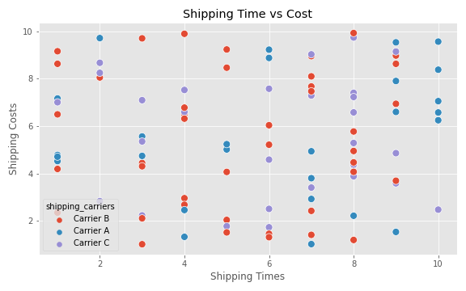
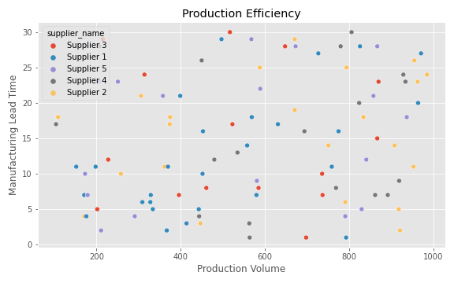
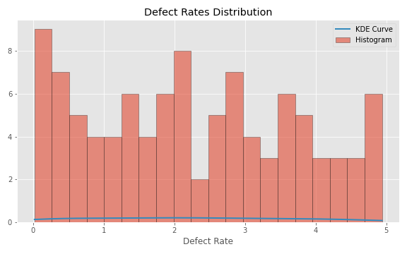
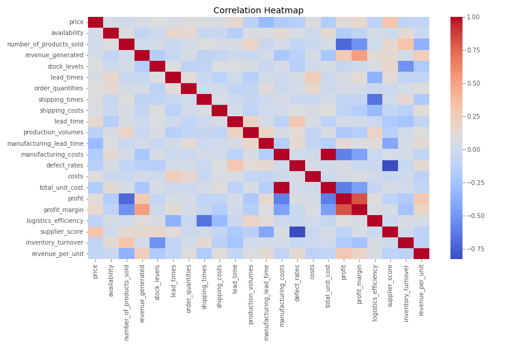

# Supply Chain Analytics & Forecasting Dashboard

## Project Overview
This project demonstrates a **Supply Chain Analytics Dashboard** simulating a real-world e-commerce environment. It focuses on **forecasting, inventory management, supplier performance, and logistics efficiency**. The goal is to provide actionable insights for supply chain optimization, vendor accountability, and operational efficiency.

The project aligns with the responsibilities of a **Supply Chain Analyst**, including:

- Sales forecasting and inventory planning
- Supplier performance monitoring
- Shipping and logistics analysis
- Financial reconciliation and cost management
- Identifying anomalies and optimizing operations

---

## Dataset Description
The dataset used for this project contains **simulated e-commerce supply chain data** with the following columns:

| Column | Description |
|--------|-------------|
| product_type | Category of the product (e.g., haircare, skincare, cosmetics) |
| sku | Unique product identifier |
| price | Unit price of the product |
| availability | Availability percentage of the product |
| number_of_products_sold | Units sold |
| revenue_generated | Total revenue for the SKU |
| customer_demographics | Customer gender/age group |
| stock_levels | Current stock quantity |
| lead_times | Supplier lead time in days |
| order_quantities | Quantity ordered from supplier |
| shipping_times | Shipping duration in days |
| shipping_carriers | Carrier used for shipping |
| shipping_costs | Shipping cost per unit |
| supplier_name | Supplier responsible for product |
| location | Supplier location |
| production_volumes | Production volume per batch |
| manufacturing_lead_time | Time to manufacture product |
| manufacturing_costs | Cost per unit manufactured |
| inspection_results | QC inspection outcome |
| defect_rates | Percentage of defective units |
| transportation_modes | Mode of transport used |
| routes | Delivery routes |
| costs | Total cost per SKU |

**Source:** Simulated dataset created for project purposes (can be replaced with real datasets like [UCI Online Retail Dataset](https://archive.ics.uci.edu/ml/datasets/online+retail)).

---

## Steps Performed

1. **Data Cleaning**
   - Standardized column names
   - Converted numeric columns
   - Filled missing values
   - Ensured dataset consistency

2. **Feature Engineering**
   - Calculated derived metrics:
     - Total cost per SKU
     - Profit and profit margin
     - Logistics efficiency
     - Supplier performance score
     - Inventory turnover
     - Revenue per unit

3. **KPI Calculations**
   - Total revenue & profit
   - Average profit margin
   - Average logistics efficiency
   - Average supplier score
   - Total units sold
   - Inventory turnover

4. **Visualizations**
   - Revenue by product type
   - Units sold vs stock levels
   - Profit margin per SKU
   - Supplier performance scores
   - Shipping time vs cost
   - Production efficiency
   - Defect rate distribution
   - Correlation heatmap of numeric features

5. **Anomaly Detection**
   - Low-stock & high-demand SKUs
   - High defect-rate SKUs
   - Suppliers with high lead times

---

## Key Visualizations

### Revenue by Product Type
  
Shows which product categories generate the highest revenue, helping prioritize inventory and marketing efforts.

---

### Units Sold vs Stock Levels
  
Highlights overstocked or understocked SKUs to optimize inventory management.

---

### Profit Margin by SKU
  
Identifies high and low-margin SKUs for cost optimization and pricing decisions.

---

### Supplier Performance Score
  
Evaluates supplier reliability, defect rates, and lead times.

---

### Shipping Time vs Shipping Cost
  
Helps select carriers that balance delivery speed and cost efficiency.

---

### Production Efficiency
  
Compares production volume vs manufacturing lead time to identify bottlenecks.

---

### Defect Rate Distribution
  
Shows distribution of defective units across SKUs for quality monitoring.

---

### Correlation Heatmap
  
Identifies relationships between numeric features like revenue, cost, lead times, and defect rates.

---

## Insights
- Certain product categories (e.g., haircare) consistently generate higher revenue.
- Some SKUs show **low stock but high demand**, indicating a risk of stockouts.
- Suppliers with higher defect rates or longer lead times need monitoring or alternative sourcing.
- Logistics efficiency varies by shipping carrier and transportation mode.
- High production volumes don’t always correspond to low manufacturing lead time — process optimization needed.

---

## Next Steps / Recommendations
- Implement **time series forecasting** (Prophet, ARIMA) for demand planning.
- Develop a **real-time dashboard** using Plotly Dash or Power BI.
- Introduce **predictive models** to forecast supplier delays and stockouts.
- Optimize inventory using **reorder point analysis** and lead-time variability.
- Integrate **cost optimization models** for shipping and manufacturing.

---

## Project Files
- `cleaned_supply_chain.csv` — Cleaned dataset  
- `feature_engineered_supply_chain.csv` — Dataset with derived metrics  
- `kpi_summary.csv` — Overall KPIs summary  
- `images/` — Folder containing all visualizations as PNGs  

---

## Technologies Used
- Python: `pandas`, `numpy`, `matplotlib`, `seaborn`  
- Data Visualization: Matplotlib & Seaborn  
- Tools: Jupyter Notebook / Anaconda  

---

## Author
**Het Patel**  
Data Analyst & Aspiring Machine Learning Engineer  
[LinkedIn](https://www.linkedin.com/in/het-patel-359184246/) | [GitHub](https://github.com/HetPatel2022)
